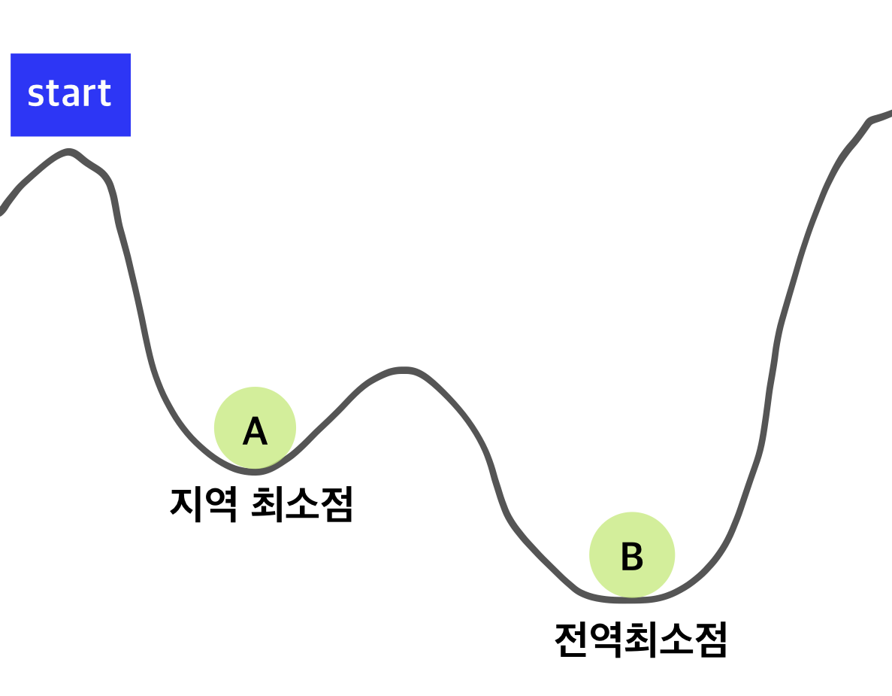

# **<span style="color: CornFlowerBlue"> [Alogrithm] 최적화 알고리즘 구현 : 모의담금질 알고리즘 </span>**

<br />

*  **<span style="color: MidnightBlue"> 회귀분석(Regression test) </span>** : 독립변인이 종속변인에 영향을 미치는지 알아보고자 할 때 실시하는 분석방법 


*  **<span style="color: MidnightBlue"> 담금질 기법 (Simulated Annealing , SA) </span>** : 광대한 탐색 공간안에서 주어진 함수의 전역 최적점(global optimum)에 대한 근사치를 찾는 기법

*  **<span style="color: MidnightBlue"> Quenching </span>** : 금속재료를 가열한 다음 조금씩 냉각해 결정을 성장시켜 결함을 줄이는 작업

*  냉각 과정에서 고체의 자유 에너지가 최소화 되는데 고체화되는 과정에서 _지역 최소점에 빠지지 않도록 하기 위해서는 천천히 식혀야한다._

* *온도를 너무 급속히 낮추면* 평행 상태를 이루어 최소 에너지 상태에 도달할 확률이 낮고 *너무 천천히 낮추면* 최소 에너지에 도달할 확률은 커지지만 많은 반복이 필요해 시간이 오래 걸린다.

* 계속해서 좋은 방향으로 움직이는 특징을 갖고있고 처음에는 좋지 않은 해답으로 시작할 수 있지만 점차 마지막에 다다러서는 좋은 해답을 선택하는 점이 Greedy 알고리즘과 닮아있다.

<br />

## **<span style="color: CornFlowerBlue"> 기본 동작 방식 </span>**

***

공이 언덕을 내려가는 그림으로 알고리즘에 대한 이해를 도울수 있다.



<br />

   start 위치에서 공을 굴리면 공은 **지역 최솟값 (Local Minima)** 에 빠진다. 하지만 **최적해는 공이 전역 최솟값 (Global Minima) 에 도달하는 것이다.** 하지만 언덕에서 공은 **현재 위치보다 높은 곳으로 이동하지 않는다.**

<br />

   이때 공이 **지역 최솟값 (Local Minima)** 를 빠져나갈 정도만 **언덕 전체를 약간 흔들어주면 공은 전역 최솟값 (Global Minima) 에 도달할 수 있게 될 것이다.** 여기서 언덕 전체를 흔들어주는 역할 을 하는것이 모의담금질 알고리즘에 적용된 **Heuristics**이다. 

<br />

   그럼 어느정도로 언덕을 흔들어야 할까? 모의 담금질 알고리즘에 의하면 처음에는 세게, 시간이 지날수록 강도를 약하게 하는 것이 효율적이다. 
   여기서 흔들어주는 세기는 담금질 방법에서 냉각속도에 해당한다. 

<br />

   냉각속도는 공을 좋지 않는 방향으로 보내는 것으로 구현할 수 있다. 

<br />

## **<span style="color: CornFlowerBlue"> 최적화 과정 분석 </span>**

<br />

최적화되는 과정에서 에러가 감소하는 경향 표현


<br />

## **<span style="color: CornFlowerBlue"> LOGIC </span>**

***

```java
begin
Get an initial solution S; //  s ← s0; e ← E(s) 초기값을 설정한다.
Get an initial temperature T>0; // 초기 온도값을 설정함, 예) T=1000

while not yet "frozen" do  // 최적의 경우를 찾을 때까지 즉 온도가 완전히 내려 갈때까지 프로그램을 Loop한다.

   for 1<= i <= P do       // P=nk 즉 Step의 사이즈가 되고 k는 주어진 종류를 n은 우리가 결정하게 된다. 즉 STEP사이즈를 결정하게 된다.
   Pick a random neighbor S' of S; // 임의로 선택한 솔루션 S' 과 기존의 솔루션 S를 선택한다.
   ∆ ← cost(S')-cost(S); // 기존의 솔루션과 새로운 솔루션을 가격의 차 즉 최적화의 값의 차를 만든다.
                          // ∆ ← area(S')-area(S), 돌을 예를 들면 면적이 크기가 효율성의 차이이다.
   /* downhill move */

   if ∆ <= 0 then S ← S' // S'의 값이 작으면 즉 차지하는 면적이 작고, 더 효율적으로 배치 되었으면,
                          // 이것이 현재까지의 최적화가 되고 이것을 온도가 내려간다. Downhill로 표현한다.
   /* uphill move */

   if ∆ > 0 then S ← S' // S'의 값이 크면 즉 차지하는 면적이 크고, 더 비 효율적으로 배치 되었으면, 이것을 온도가 올라간다.
                         //  uphill로 표현한다.

T ← rT; // 한가지 경우의 수를 처리 했었므로 한 단계 줄어 들게 되면 다음 반복을 진행한다.

return S    // 프로그램이 마무리 되면 우리가 찾는 최적화의 답을 리턴하고, 정확히 최적화의 답을 찾았으면 이것을 Global Optimization 즉 모든 경우의 수중에서 가장 최적화된 것이다.

end
```

<br />

## **<span style="color: CornFlowerBlue"> CODE </span>**

***
```java

```


<br />

<br />
<br />
<br />


***

참고 : Simulated Annealing| 작성자 임경업 , https://sens.tistory.com/404

